<div align="center">



### A free, open-source video and audio downloader for Chrome — find and save media from any web page

[](LICENSE)
[](manifest.json)
[](CONTRIBUTING.md)
[](https://github.com/riponcm/media-grabber/stargazers)

</div>

---

**Media Grabber** is a fast, lightweight **video and audio downloader** built as a dependency-free
Chrome extension (Manifest V3). It automatically detects the real media source behind any web page
so you can **download video and audio in one click** — even when the site has no download button.
For adaptive **HLS and DASH streams** (`.m3u8`, `.mpd`), it generates a ready-to-run **FFmpeg**
command to save them.

> If this project saves you time, please consider giving it a star. It takes one click, costs you
> nothing, and is the single best way to help other people discover it.

## Features

- **Network detection.** Watches response content types and catches media files
  (`mp3`, `m4a`, `aac`, `ogg`, `wav`, `flac`, `mp4`, `webm`, `mov`, and more).
- **Page detection.** Scans the DOM for `<audio>` and `<video>` elements, including the source
  that is actually playing.
- **One-click downloads.** Saves direct files through the browser's own download manager.
- **Stream support.** Detects HLS and DASH playlists (`.m3u8`, `.mpd`) and produces a copy-paste
  FFmpeg command to save them.
- **Per-tab badge.** Shows how many media items were found on the current tab.
- **Private by design.** No accounts, no tracking, no external servers. Everything runs locally.

## Capabilities and limits

| Media type | Detect | Download |
| --- | :---: | :---: |
| Direct files (`mp3`, `mp4`, `webm`, ...) | Yes | Yes, one click |
| HTML5 `<audio>` / `<video>` with a URL | Yes | Yes |
| HLS / DASH streams (`m3u8`, `mpd`) | Yes | Via the generated FFmpeg command |
| MSE blob streams (for example YouTube) | Element only | Not directly |
| DRM-protected media (Spotify, Netflix) | No | No, encrypted and not bypassed |

## Installation

This extension is unpacked (developer) and needs no build step.

1. Open Chrome and go to `chrome://extensions`.
2. Enable **Developer mode** using the toggle in the top-right corner.
3. Click **Load unpacked**.
4. Select the project folder.
5. Pin **Media Grabber** from the extensions menu.

## Usage

1. Open a page and start playing the audio or video.
2. Click the Media Grabber toolbar icon to see detected media.
3. Press **Download** for files, or **Copy FFmpeg** for streams and run the command:
   ```bash
   ffmpeg -i "STREAM_URL" -c copy "output.mp4"
   ```
4. Use the re-scan button if media loads late.

## How it works

```
                 +------------------------+
  network ─────► |   background worker    |
  responses      |  (webRequest sniffer)  | ──┐
                 +------------------------+   │   per-tab,
                                              ├─► de-duplicated  ──► popup UI
                 +------------------------+   │   media list
  page DOM ────► |     content script     | ──┘
  <audio>/<video>|  (element scanner)     |
                 +------------------------+
```

- `src/background.js` observes `webRequest` responses and classifies them by content type.
- `src/content.js` scans the page for media elements and reports them.
- `src/popup.js` renders the combined list and triggers downloads.

## Project structure

```
media-grabber/
├─ manifest.json          Extension manifest (Manifest V3)
├─ src/
│  ├─ background.js        Network sniffer and per-tab media store
│  ├─ content.js           DOM media scanner
│  ├─ popup.html           Toolbar UI
│  ├─ popup.css            Toolbar styles
│  └─ popup.js             Toolbar logic
├─ icons/                  Toolbar icons (16, 32, 48, 128)
└─ assets/                 Logo and brand assets
```

## Responsible use

Use Media Grabber only for media you have the right to download, such as your own files,
public-domain or Creative Commons content, or media you are licensed to keep. Respect the terms
of service of the sites you visit and all applicable copyright law. The extension deliberately
does not attempt to bypass DRM.

## Contributing

Contributions are welcome. Please read [CONTRIBUTING.md](CONTRIBUTING.md) and open an issue or
pull request. If you like the direction of the project, a star is a great way to show support.

## Topics

chrome-extension · video-downloader · audio-downloader · media-downloader · hls-downloader ·
m3u8 · dash · ffmpeg · stream-downloader · manifest-v3 · javascript · open-source

## License

Released under the [MIT License](LICENSE).

<div align="center">

If Media Grabber is useful to you, consider starring the repository.

[](https://github.com/riponcm/media-grabber)

</div>
